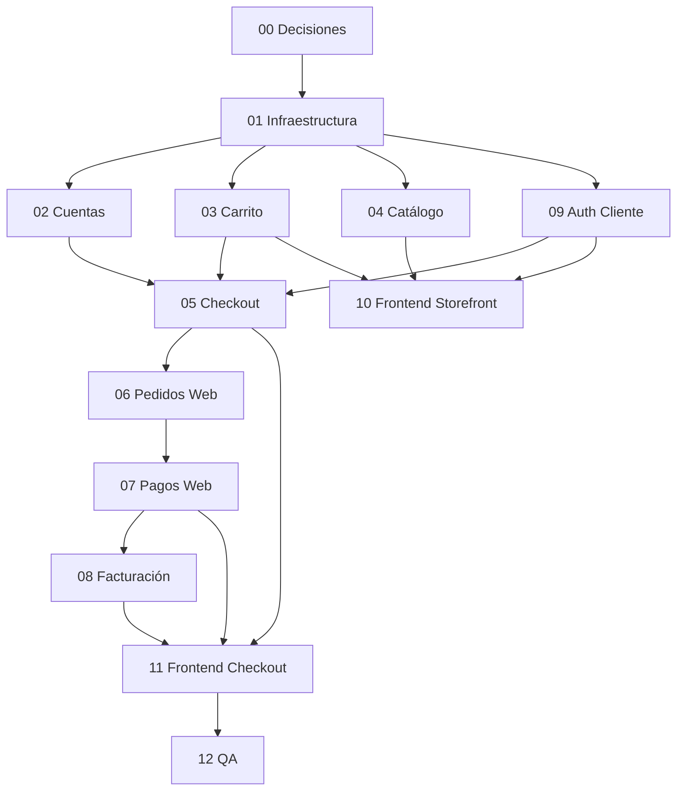

# AKINOMASS — Tienda Online (Storefront B2C)

Documentación maestra para implementar el **front-office** (tienda pública + área del cliente) sin modificar tablas de negocio existentes. Solo **migraciones nuevas**, reutilización de `pedidos`, `detalles_pedido`, `pagos`, `productos`, `clientes` e `inventarios`.

---

## Objetivo del programa

Permitir que un visitante:

1. Navegue el catálogo público (productos, precios, stock visible).
2. Agregue productos al carrito (invitado en Redis; registrado en Redis + PostgreSQL).
3. Deba **registrarse/iniciar sesión** para checkout.
4. Obtenga rol **Cliente** y enlace `User` ↔ `Cliente` (`cuentas_cliente`).
5. Complete checkout → **pedido** + **pago pendiente** (tablas existentes).
6. Tras confirmación operativa del pago → **pedido confirmado** + **factura**.

El **back-office** (panel admin actual) no se reemplaza; convive con la tienda.

---

## Principios arquitectónicos (obligatorios)

| Principio | Detalle |
|-----------|---------|
| Sin ALTER en tablas de negocio existentes | `clientes`, `pedidos`, `pagos`, `productos`, etc. intactas |
| Flujo de capas | `Controller → FormRequest → DTO → Action → Service → Repository → Model` |
| Dominio nuevo | `app/Domains/Tienda/` (subdominios por sprint) |
| Modelos Eloquent | `app/Models/` (nuevos modelos solo para tablas nuevas) |
| Controladores HTTP | `app/Http/Controllers/Tienda/` |
| Rutas | Grupo en `routes/web.php` o `routes/tienda.php` |
| Frontend | `resources/js/Pages/Tienda/`, layouts `StorefrontLayout`, `CustomerLayout` |
| Pasarelas externas v1 | No Stripe/PayPal automático; QR/transferencia/efectivo manual (README_CODEX) |
| Enums | PHP Enums en dominio; no strings mágicos |

---

## Mapa de sprints

| Sprint | Documento | Enfoque | Depende de |
|--------|-----------|---------|------------|
| 00 | [SPRINT_TIENDA_00_DECISIONES_Y_ALCANCE.md](./SPRINT_TIENDA_00_DECISIONES_Y_ALCANCE.md) | Decisiones, alcance, preguntas | — |
| 01 | [SPRINT_TIENDA_01_INFRAESTRUCTURA.md](./SPRINT_TIENDA_01_INFRAESTRUCTURA.md) | Redis cart, roles, seeders, config | 00 |
| 02 | [SPRINT_TIENDA_02_CUENTAS_DIRECCIONES.md](./SPRINT_TIENDA_02_CUENTAS_DIRECCIONES.md) | `cuentas_cliente`, `direcciones_cliente` | 01 |
| 03 | [SPRINT_TIENDA_03_CARRITO.md](./SPRINT_TIENDA_03_CARRITO.md) | Redis + `carritos`, `detalles_carrito` | 01 |
| 04 | [SPRINT_TIENDA_04_CATALOGO_PUBLICO.md](./SPRINT_TIENDA_04_CATALOGO_PUBLICO.md) | Catálogo visitante | 01 |
| 05 | [SPRINT_TIENDA_05_CHECKOUT.md](./SPRINT_TIENDA_05_CHECKOUT.md) | `checkout_sesiones` | 02, 03 |
| 06 | [SPRINT_TIENDA_06_PEDIDOS_WEB.md](./SPRINT_TIENDA_06_PEDIDOS_WEB.md) | `pedidos_tienda` + Actions pedido | 05 |
| 07 | [SPRINT_TIENDA_07_PAGOS_WEB.md](./SPRINT_TIENDA_07_PAGOS_WEB.md) | `pagos_tienda` + flujo pago | 06 |
| 08 | [SPRINT_TIENDA_08_FACTURACION.md](./SPRINT_TIENDA_08_FACTURACION.md) | `facturas`, `detalles_factura` | 07 |
| 09 | [SPRINT_TIENDA_09_AUTENTICACION_ROL_CLIENTE.md](./SPRINT_TIENDA_09_AUTENTICACION_ROL_CLIENTE.md) | Registro/login tienda | 01, 02 |
| 10 | [SPRINT_TIENDA_10_FRONTEND_STOREFRONT.md](./SPRINT_TIENDA_10_FRONTEND_STOREFRONT.md) | UI catálogo + carrito | 03, 04, 09 |
| 11 | [SPRINT_TIENDA_11_FRONTEND_CHECKOUT_CUENTA.md](./SPRINT_TIENDA_11_FRONTEND_CHECKOUT_CUENTA.md) | UI checkout, mi cuenta | 05–09, 10 |
| 12 | [SPRINT_TIENDA_12_QA_INTEGRACION.md](./SPRINT_TIENDA_12_QA_INTEGRACION.md) | Pruebas, demo, PR | Todos |

**Preguntas abiertas del equipo:** [SPRINT_TIENDA_PREGUNTAS_ABIERTAS.md](./SPRINT_TIENDA_PREGUNTAS_ABIERTAS.md)

**Esquema BD consolidado (todas las tablas nuevas):** [SPRINT_TIENDA_ESQUEMA_BD.md](./SPRINT_TIENDA_ESQUEMA_BD.md)

---

## Orden de ejecución recomendado (crítico)

**Paralelizable:** 02 + 03 + 04 + 09 tras 01. **10** tras 03+04+09. **11** tras backend 05–08.

---

## Asignación sugerida por perfil

| Perfil | Sprints naturales |
|--------|-------------------|
| Backend senior | 01, 05, 06, 07, 08 |
| Backend mid | 02, 03, 04, 09 |
| Frontend | 10, 11 |
| Fullstack | 09 + 11 (auth + checkout UI) |
| QA / líder técnico | 00, 12 |

Alineado con equipo actual (INSTRUCCIONES_FRONTEND): Victor → catálogo/stock; Marcelo → pedidos/pagos; Carla → CRM/clientes (cuentas_cliente).

---

## Convención Git por sprint

| Sprint | Rama feature sugerida |
|--------|----------------------|
| 01 | `feature/tienda-01-infraestructura` |
| 02 | `feature/tienda-02-cuentas-direcciones` |
| 03 | `feature/tienda-03-carrito` |
| 04 | `feature/tienda-04-catalogo-publico` |
| 05 | `feature/tienda-05-checkout` |
| 06 | `feature/tienda-06-pedidos-web` |
| 07 | `feature/tienda-07-pagos-web` |
| 08 | `feature/tienda-08-facturacion` |
| 09 | `feature/tienda-09-auth-cliente` |
| 10 | `feature/tienda-10-frontend-storefront` |
| 11 | `feature/tienda-11-frontend-checkout-cuenta` |
| 12 | `feature/tienda-12-qa-integracion` |

Cada PR a `develop` con: `php artisan migrate:status`, `npm run build`, checklist del sprint.

---

## Tablas nuevas (resumen)

| Tabla | Sprint |
|-------|--------|
| `cuentas_cliente` | 02 |
| `direcciones_cliente` | 02 |
| `carritos` | 03 |
| `detalles_carrito` | 03 |
| `checkout_sesiones` | 05 |
| `pedidos_tienda` | 06 |
| `pagos_tienda` | 07 |
| `facturas` | 08 |
| `detalles_factura` | 08 |

**Redis:** carrito invitado (conexión `cart`, DB lógica `2`). Sprint 01 + 03.

**Tablas reutilizadas (solo INSERT/UPDATE vía Actions):** `clientes`, `pedidos`, `detalles_pedido`, `pagos`, `productos`, `inventarios`, `movimientos_inventario`.

---

## Documentación relacionada existente

- [README_ARQUITECTURA.md](./README_ARQUITECTURA.md)
- [README_REGLAS_BACKEND.md](./README_REGLAS_BACKEND.md)
- [README_REGLAS_FRONTEND.md](./README_REGLAS_FRONTEND.md)
- [README_CODEX.md](./README_CODEX.md)
- [INSTRUCCIONES_FRONTEND_AKINOSMASS.md](./INSTRUCCIONES_FRONTEND_AKINOSMASS.md)
- [README_FLUJO_GIT.md](./README_FLUJO_GIT.md)

---

## Criterio de cierre del programa

- [x] Visitante navega el catálogo público sin autenticación.
- [x] Carrito invitado y autenticado con persistencia, reservas y TTL.
- [x] Registro e inicio de sesión del cliente con rol `Cliente` y vínculo de cuenta.
- [x] Checkout genera pedido y pago mediante las tablas de negocio y tablas puente.
- [x] Cliente consulta sus pedidos y el detalle de cada compra.
- [x] Cliente registra y resube comprobantes de pago.
- [x] Facturación automática posterior a la confirmación del pago.
- [x] Administración de pedidos y pagos de tienda desde el back-office.
- [x] Build de producción validado en la revisión pre-PR del 19 de junio de 2026.
- [x] Compatibilidad preservada con las tablas legacy mediante migraciones incrementales.

Validación registrada en `dev/vicente`: `npm run build` completado correctamente
con Vite 8.

---

## Integración con Machine Learning comercial

El historial generado por la tienda alimenta dos herramientas del módulo
`InteligenciaVentas`:

- segmentación de clientes mediante K-Means con normalización Min-Max;
- predicción de tendencias mediante regresión lineal simple `y = a + bx`.

Se utilizan pedidos confirmados, pagos aceptados y detalles de venta. Los
resultados son estimaciones para apoyar fidelización y abastecimiento, no
predicciones absolutas.

> [!NOTE]
> El dataset demo de defensa académica (`DemoAkinomassDefensaSeeder`) alimenta de manera integral la tienda online (incluyendo imágenes demo locales generadas para el catálogo de productos para reforzar la presentación visual), pagos, pedidos y facturación interna para evidenciar el flujo completo B2C en la demostración académica del sistema.

