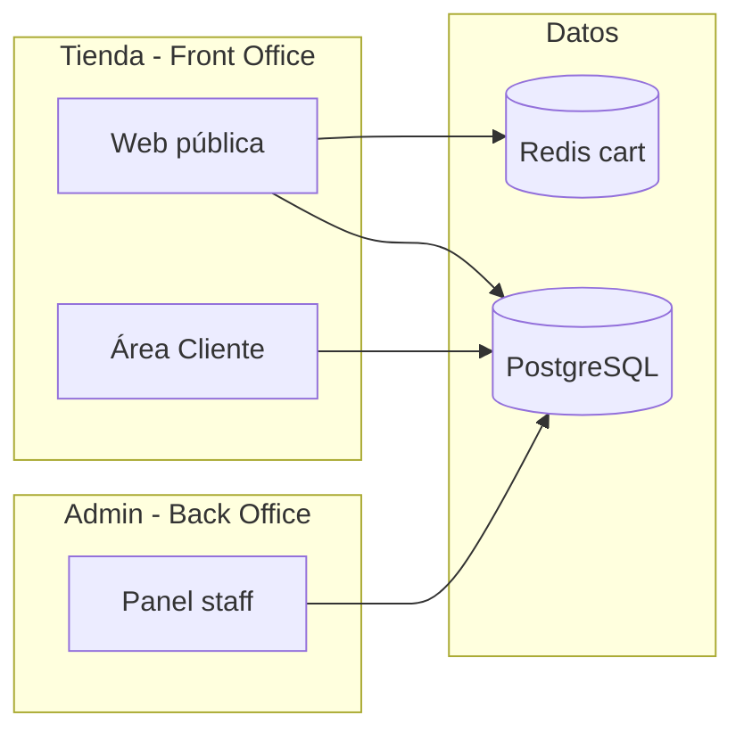

# Sprint 00 — Decisiones y alcance

| Campo | Valor |
|-------|-------|
| **ID** | TIENDA-00 |
| **Duración estimada** | 1–2 días |
| **Tipo** | Planificación / acuerdo de equipo |
| **Bloquea** | Todos los sprints 01–12 |

---

## Objetivo

Alinear alcance, decisiones de negocio y división de trabajo antes de escribir código de la tienda online.

---

## Entregables

| # | Entregable | Formato |
|---|------------|---------|
| 1 | Respuestas en [SPRINT_TIENDA_PREGUNTAS_ABIERTAS.md](./SPRINT_TIENDA_PREGUNTAS_ABIERTAS.md) | Tabla completada |
| 2 | Acta breve de alcance v1 (in / out) | Sección abajo firmada en reunión |
| 3 | Asignación desarrollador ↔ sprint | Tabla en README o Excel equipo |
| 4 | Aprobación de no modificar tablas existentes | Checkbox equipo |

---

## Alcance IN (v1)

| # | Funcionalidad |
|---|---------------|
| 1 | Catálogo público de productos activos con stock > 0 (o indicador agotado) |
| 2 | Carrito invitado (Redis) y persistido (PostgreSQL) para usuarios |
| 3 | Registro/login con rol **Cliente** |
| 4 | Enlace `users` ↔ `clientes` vía `cuentas_cliente` |
| 5 | Checkout con dirección y datos de facturación |
| 6 | Creación de `pedidos` + `detalles_pedido` + `pagos` (flujo existente) |
| 7 | Metadata web en `pedidos_tienda`, `pagos_tienda` |
| 8 | Emisión de `facturas` + `detalles_factura` tras confirmación |
| 9 | Área "Mis pedidos" / "Mi cuenta" (cliente) |
| 10 | Confirmación manual de pago desde back-office |

---

## Alcance OUT (v1 explícito)

| # | Excluido |
|---|----------|
| 1 | Pasarelas automáticas (Stripe, PayPal, Mercado Pago API) |
| 2 | Integración WhatsApp / TikTok / bots |
| 3 | Facturación electrónica legal conectada al SIN |
| 4 | Cupones, wishlist, comparador |
| 5 | Multi-tienda / multi-vendedor |
| 6 | Alteración de migraciones ya ejecutadas en `clientes`, `pedidos`, `pagos` |
| 7 | FastAPI / analítica predictiva |

---

## Diagrama de contexto

---

## Condiciones técnicas obligatorias

| Condición | Verificación |
|-----------|--------------|
| Nuevas tablas siguen convención `nombre_atributo_abrev` | Revisión en PR |
| PK `cod_<entidad>` | Migraciones |
| Lógica en `app/Domains/Tienda/` | No en controladores |
| Reutilizar `CrearPedidoAction`, `RegistrarPagoAction`, `ConfirmarPedidoAction` | Sprint 06–07 |
| Rol Cliente sin permisos admin | Sprint 01, 09 |
| `npm run build` en cada PR frontend | CI local |

---

## Criterios de aceptación Sprint 00

- [ ] Tabla P01–P15 resuelta o aplican defaults del doc de preguntas.
- [ ] Equipo conoce orden de sprints (README_TIENDA_ONLINE).
- [ ] Ramas feature nombradas y asignadas.
- [ ] Acuerdo escrito: **no** `migrate:fresh` en entornos compartidos sin aviso.

---

## Reunión sugerida (agenda 60 min)

1. Revisar preguntas P01–P15 (15 min).
2. Demo del admin actual: pedido + pago manual (10 min).
3. Recorrido flujo usuario final en pizarra (15 min).
4. Asignación sprints y fechas (15 min).
5. Riesgos: stock concurrente, doble carrito (5 min).
