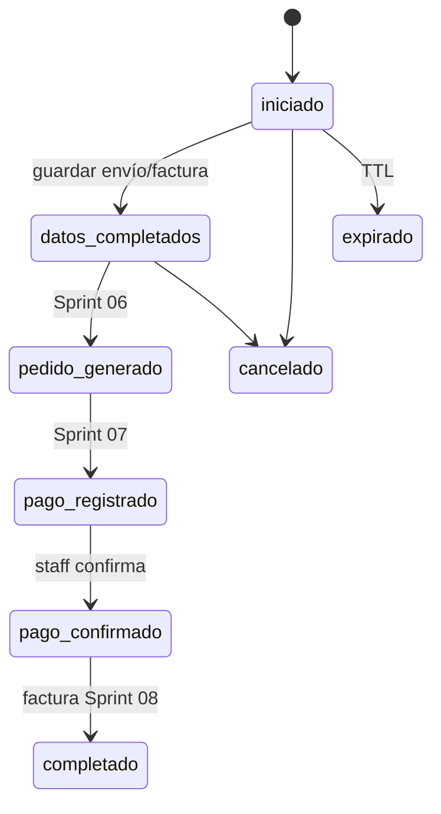

# Sprint 05 — Checkout (sesión de compra)

| Campo | Valor |
|-------|-------|
| **ID** | TIENDA-05 |
| **Duración estimada** | 5–6 días |
| **Perfil** | Backend senior |
| **Rama** | `feature/tienda-05-checkout` |
| **Depende de** | 02, 03, 09 (auth cliente) |
| **Habilita** | 06, 11 |

---

## Objetivo

Gestionar el proceso de compra desde carrito hasta datos de envío/facturación, persistiendo estado en `checkout_sesiones` antes de crear pedido y pago.

---

## Migración: `checkout_sesiones`

| Columna | Tipo | Null | Default | Índice / FK |
|---------|------|:----:|---------|-------------|
| `cod_checkout_sesion` | `bigIncrements` | NO | — | PK |
| `cod_cuenta_cliente` | `unsignedBigInteger` | NO | — | FK → `cuentas_cliente` |
| `cod_carrito` | `unsignedBigInteger` | SÍ | `null` | FK → `carritos` |
| `cod_direccion_cliente` | `unsignedBigInteger` | SÍ | `null` | FK → `direcciones_cliente` |
| `estado_che` | `string(30)` | NO | `iniciado` | INDEX |
| `email_contacto_che` | `string(255)` | NO | — | — |
| `telefono_contacto_che` | `string(30)` | SÍ | `null` | — |
| `direccion_entrega_che` | `text` | SÍ | `null` | Snapshot |
| `documento_facturacion_che` | `string(30)` | SÍ | `null` | |
| `razon_social_che` | `string(255)` | SÍ | `null` | |
| `subtotal_che` | `decimal(12,2)` | NO | `0` | |
| `descuento_che` | `decimal(12,2)` | NO | `0` | |
| `impuesto_che` | `decimal(12,2)` | NO | `0` | |
| `total_che` | `decimal(12,2)` | NO | `0` | |
| `metodo_pago_elegido_che` | `string(30)` | SÍ | `null` | |
| `referencia_pago_che` | `string(150)` | SÍ | `null` | |
| `comprobante_ruta_che` | `string(255)` | SÍ | `null` | |
| `token_che` | `string(64)` | SÍ | `null` | UNIQUE |
| `expira_en_che` | `timestamp` | SÍ | `null` | |
| `completado_en_che` | `timestamp` | SÍ | `null` | |
| `created_at` | `timestamp` | SÍ | | |
| `updated_at` | `timestamp` | SÍ | | |

### Enum: `EstadoCheckoutSesionEnum`

| Case | Valor | Siguiente estado típico |
|------|-------|---------------------------|
| `INICIADO` | `iniciado` | `datos_completados` |
| `DATOS_COMPLETADOS` | `datos_completados` | `pedido_generado` |
| `PEDIDO_GENERADO` | `pedido_generado` | `pago_registrado` |
| `PAGO_REGISTRADO` | `pago_registrado` | `pago_confirmado` |
| `PAGO_CONFIRMADO` | `pago_confirmado` | `completado` |
| `COMPLETADO` | `completado` | — |
| `EXPIRADO` | `expirado` | — |
| `CANCELADO` | `cancelado` | — |

---

## Máquina de estados

---

## Actions

| Action | Descripción |
|--------|-------------|
| `IniciarCheckoutAction` | Desde carrito activo; `estado_car → en_checkout` |
| `ActualizarDatosCheckoutAction` | Dirección, contacto, facturación |
| `CalcularTotalesCheckoutAction` | subtotal, descuento, impuesto, total |
| `CancelarCheckoutAction` | `cancelado`; libera carrito |
| `ExpirarCheckoutSesionesAction` | Job/command programado |

---

## Validaciones (`FormRequest`)

| Request | Reglas clave |
|---------|--------------|
| `IniciarCheckoutRequest` | carrito no vacío, usuario Cliente |
| `ActualizarDatosCheckoutRequest` | email, teléfono, dirección o `cod_direccion_cliente` |
| `SeleccionarMetodoPagoCheckoutRequest` | `metodo_pago_elegido_che` ∈ MetodoPagoEnum |

---

## Rutas

| Método | Ruta | Auth | Permiso |
|--------|------|------|---------|
| POST | `/tienda/checkout` | Sí | `checkout.iniciar` |
| GET | `/tienda/checkout/{token}` | Sí | `checkout.iniciar` |
| PATCH | `/tienda/checkout/{token}/datos` | Sí | `checkout.iniciar` |
| POST | `/tienda/checkout/{token}/cancelar` | Sí | `checkout.iniciar` |

**Condición:** `token_che` UUID para URL amigable sin exponer PK.

---

## TTL y expiración

| Parámetro | Valor sugerido |
|-----------|----------------|
| `expira_en_che` | `now() + 2 hours` desde `iniciado` |
| Job | `ExpirarCheckoutSesionesJob` cada 15 min |

Al expirar: `estado_che = expirado`, `estado_car = activo` (si aplica).

---

## Condiciones

| # | Condición |
|---|-----------|
| 1 | Checkout **requiere** auth + rol Cliente |
| 2 | Totales siempre recalculados server-side desde carrito |
| 3 | No crear `pedidos` en este sprint (Sprint 06) |
| 4 | Snapshot dirección en `direccion_entrega_che` aunque exista FK |

---

## Criterios de aceptación

- [ ] Usuario con carrito inicia checkout → fila `checkout_sesiones`.
- [ ] Actualizar datos cambia `estado_che` a `datos_completados`.
- [ ] Checkout ajeno (otro user) → 403.
- [ ] Sesión expirada no permite continuar.
- [ ] Tests transición de estados.
