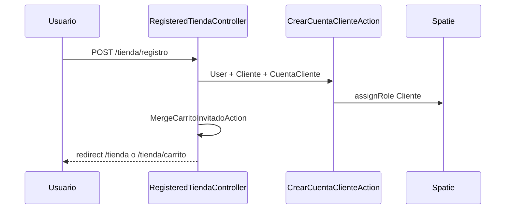

# Sprint 09 — Autenticación y rol Cliente (tienda)

| Campo | Valor |
|-------|-------|
| **ID** | TIENDA-09 |
| **Duración estimada** | 3–4 días |
| **Perfil** | Fullstack |
| **Rama** | `feature/tienda-09-auth-cliente` |
| **Depende de** | Sprint 01, 02 |
| **Habilita** | 05, 10, 11 |
| **Paralelo con** | 03, 04 |

---

## Objetivo

Registro e inicio de sesión para compradores: rol **Cliente**, creación de `clientes` + `cuentas_cliente`, redirecciones separadas del panel admin, merge de carrito post-login.

---

## Flujos

### Registro tienda



### Login tienda

| Condición | Redirect |
|-----------|----------|
| Rol Cliente | `/tienda` o `intended` |
| Rol staff | `/dashboard` (comportamiento actual) |
| Cliente intenta `/dashboard` | 403 o redirect `/tienda` |

---

## Archivos a crear/modificar

| Archivo | Acción |
|---------|--------|
| `app/Http/Controllers/Tienda/Auth/RegisteredClienteController.php` | Nuevo |
| `app/Http/Controllers/Tienda/Auth/AuthenticatedClienteController.php` | Opcional wrapper |
| `app/Http/Middleware/EnsureUserIsCliente.php` | Nuevo |
| `app/Http/Middleware/RedirectIfCliente.php` | Evita admin |
| `routes/tienda.php` | Rutas auth |
| `resources/js/Pages/Tienda/Auth/Register.jsx` | UI |
| `resources/js/Pages/Tienda/Auth/Login.jsx` | UI |

**Condición:** evaluar si Breeze `Register` se deshabilita públicamente o se redirige a `/tienda/registro`.

---

## Formulario registro — campos

| Campo | Validación |
|-------|------------|
| `name` | required, max 255 |
| `email` | required, email, unique users |
| `password` | required, confirmed, Rules\Password |
| `telefono_cli` | nullable, max 30 |
| `terminos` | accepted (opcional legal) |

---

## `RegisteredClienteController::store` (pasos)

| # | Paso |
|---|------|
| 1 | Validar request |
| 2 | `User::create` |
| 3 | `CrearCuentaClienteAction` (cliente + cuenta) |
| 4 | `$user->assignRole('Cliente')` |
| 5 | `event(Registered)` |
| 6 | `Auth::login` |
| 7 | `MergeCarritoInvitadoAction` |
| 8 | `redirect()->intended('/tienda')` |

---

## Rutas auth tienda

| Método | Ruta | Middleware |
|--------|------|------------|
| GET | `/tienda/login` | guest |
| POST | `/tienda/login` | guest |
| GET | `/tienda/registro` | guest |
| POST | `/tienda/registro` | guest |
| POST | `/tienda/logout` | auth |

---

## Separación guards / policies

| Regla | Implementación |
|-------|----------------|
| Cliente no accede rutas `middleware(['auth','verified'])` del admin | Excluir rutas admin de Cliente o middleware `role:Administrador|...` |
| Staff puede usar tienda como opcional | No requerido v1 |

### Middleware stack rutas tienda autenticadas

```php
Route::middleware(['auth', 'verified', 'role:Cliente'])->group(function () {
    // checkout, cuenta, etc.
});
```

---

## Integración Inertia

Compartir en `HandleInertiaRequests` (opcional):

| Prop | Uso |
|------|-----|
| `auth.user.roles` | Ocultar links admin en storefront |
| `cuenta_cliente` | `cod_cliente` resuelto |

---

## Condiciones

| # | Condición |
|---|-----------|
| 1 | No eliminar auth Breeze admin |
| 2 | Email único global (users) |
| 3 | Si email ya existe como staff → mensaje claro |
| 4 | `CrearCuentaClienteAction` idempotente ante reintentos |

---

## Criterios de aceptación

- [ ] Registro crea User + Cliente + CuentaCliente + rol Cliente.
- [ ] Login cliente no entra a `/dashboard`.
- [ ] Staff login sigue yendo a dashboard.
- [ ] Carrito guest merge tras registro.
- [ ] Tests Feature registro/login.

---

## Preguntas vinculadas

- P14: redirect Cliente fuera de admin.
- P05: carrito visible antes de login.
