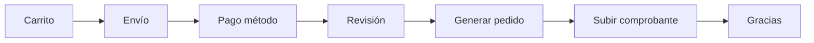

# Sprint 11 — Frontend checkout y área cliente

| Campo | Valor |
|-------|-------|
| **ID** | TIENDA-11 |
| **Duración estimada** | 6–8 días |
| **Perfil** | Frontend (Marcelo) + Fullstack |
| **Rama** | `feature/tienda-11-frontend-checkout-cuenta` |
| **Depende de** | 05–10 |
| **Habilita** | 12 |

---

## Objetivo

UI de checkout multi-paso, registro de pago con comprobante, área "Mi cuenta" (pedidos, direcciones, factura).

---

## Flujo UI (pasos)

| Paso | Pantalla | Backend |
|------|----------|---------|
| 1 | Resumen carrito | Sprint 03 |
| 2 | Datos envío / facturación | PATCH checkout datos |
| 3 | Método de pago | selección enum |
| 4 | Revisión + confirmar pedido | POST generar-pedido |
| 5 | Subir comprobante + referencia | POST pago |
| 6 | Confirmación | estado checkout |

---

## Páginas

| Página | Ruta |
|--------|------|
| `Tienda/Checkout/Index.jsx` | `/tienda/checkout/{token}` |
| `Tienda/Checkout/PasoEnvio.jsx` | mismo layout wizard |
| `Tienda/Checkout/PasoPago.jsx` | |
| `Tienda/Checkout/Confirmacion.jsx` | post compra |
| `Tienda/Cuenta/Index.jsx` | `/tienda/mi-cuenta` |
| `Tienda/Cuenta/Pedidos.jsx` | `/tienda/mis-pedidos` |
| `Tienda/Cuenta/PedidoShow.jsx` | `/tienda/mis-pedidos/{id}` |
| `Tienda/Cuenta/Direcciones.jsx` | `/tienda/mis-direcciones` |
| `Tienda/Cuenta/FacturaShow.jsx` | `/tienda/mis-pedidos/{id}/factura` |

**Layout:** `CustomerLayout.jsx` (sidebar cuenta: Pedidos, Direcciones, Perfil).

---

## Checkout — campos formulario

### Envío

| Campo | Request key |
|-------|-------------|
| Dirección guardada | `cod_direccion_cliente` |
| O nueva dirección | campos `*_dir` |
| Teléfono contacto | `telefono_contacto_che` |

### Facturación

| Campo | Request key |
|-------|-------------|
| Documento | `documento_facturacion_che` |
| Razón social | `razon_social_che` |

### Pago

| Campo | Request key |
|-------|-------------|
| Método | `metodo_pago_elegido_che` |
| Referencia | `referencia_pago_che` |
| Archivo | `comprobante` |

---

## Badges de estado (StatusBadge)

### Pedido

| `estado_ped` | Color semántico |
|--------------|-----------------|
| `borrador` | gris |
| `confirmado` | verde |
| `preparando` | terracota |
| `enviado` | azul |
| `entregado` | verde |
| `cancelado` | rojo |

### Pago

| `estado_pago_pag` | Color |
|-------------------|-------|
| `pendiente` | terracota |
| `pagado` | verde |
| `observado` | terracota |
| `rechazado` | rojo |

---

## Mensajes obligatorios UI

| Ubicación | Texto |
|-----------|-------|
| Paso pago | "Registrar tu pago no confirma la acreditación bancaria automáticamente." |
| Confirmación | "Te notificaremos cuando validemos tu pago." |
| Factura | "Comprobante interno" si P03 = recibo |

---

## Direcciones CRUD

| Acción | Inertia |
|--------|---------|
| Listar | GET props |
| Crear | `useForm` POST |
| Editar | PATCH |
| Predeterminada | PATCH |
| Eliminar | DELETE soft |

---

## Condiciones

| # | Condición |
|---|-----------|
| 1 | `preserveScroll` en listas |
| 2 | Wizard no pierde `token_che` en URL |
| 3 | Archivo comprobante: preview opcional |
| 4 | Solo pedidos propios en Mis pedidos |

---

## Criterios de aceptación

- [ ] Flujo completo demo: registro → carrito → checkout → pedido → pago pendiente.
- [ ] Usuario ve estado pedido/pago actualizado (poll o refresh).
- [ ] Factura imprimible si emitida.
- [ ] CRUD direcciones funcional.
- [ ] `npm run build` OK.

---

## Dependencias API (checklist integración)

- [ ] POST `/tienda/checkout`
- [ ] PATCH `/tienda/checkout/{token}/datos`
- [ ] POST `/tienda/checkout/{token}/generar-pedido`
- [ ] POST `/tienda/checkout/{token}/pago`
- [ ] GET `/tienda/mis-pedidos`
- [ ] GET factura
