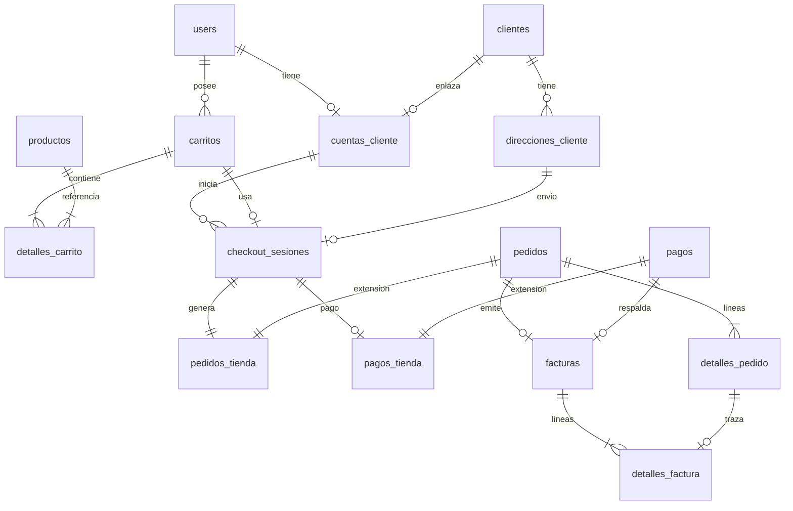

# Esquema de base de datos — Tienda Online (tablas nuevas)

Referencia consolidada. **No modifica** tablas existentes; solo FK hacia ellas.

**Tablas existentes reutilizadas (solo lectura/INSERT vía Actions):**  
`users`, `clientes`, `productos`, `categorias_producto`, `inventarios`, `pedidos`, `detalles_pedido`, `pagos`, `canales_venta`, `tipos_flujo_comercial`, `movimientos_inventario`.

---

## Diagrama entidad-relación (nuevas tablas)

---

## 1. `cuentas_cliente`

| Columna | Tipo PostgreSQL | Null | Default | Restricción |
|---------|-----------------|:----:|---------|------------|
| `cod_cuenta_cliente` | `BIGSERIAL` | NO | — | PK |
| `user_id` | `BIGINT` | NO | — | FK → `users.id`, UNIQUE |
| `cod_cliente` | `BIGINT` | NO | — | FK → `clientes.cod_cliente`, UNIQUE |
| `estado_cue` | `VARCHAR(20)` | NO | `'activa'` | INDEX |
| `fecha_activacion_cue` | `TIMESTAMP` | SÍ | NULL | — |
| `created_at` | `TIMESTAMP` | SÍ | NULL | — |
| `updated_at` | `TIMESTAMP` | SÍ | NULL | — |

**Sprint:** 02

---

## 2. `direcciones_cliente`

| Columna | Tipo | Null | Default | Restricción |
|---------|------|:----:|---------|------------|
| `cod_direccion_cliente` | `BIGSERIAL` | NO | — | PK |
| `cod_cliente` | `BIGINT` | NO | — | FK → `clientes` |
| `etiqueta_dir` | `VARCHAR(50)` | NO | — | — |
| `nombre_destinatario_dir` | `VARCHAR(255)` | NO | — | — |
| `telefono_dir` | `VARCHAR(30)` | SÍ | NULL | — |
| `direccion_dir` | `TEXT` | NO | — | — |
| `ciudad_dir` | `VARCHAR(100)` | SÍ | NULL | — |
| `departamento_dir` | `VARCHAR(100)` | SÍ | NULL | — |
| `codigo_postal_dir` | `VARCHAR(20)` | SÍ | NULL | — |
| `referencia_dir` | `TEXT` | SÍ | NULL | — |
| `documento_nit_dir` | `VARCHAR(30)` | SÍ | NULL | — |
| `razon_social_dir` | `VARCHAR(255)` | SÍ | NULL | — |
| `es_predeterminada_dir` | `BOOLEAN` | NO | `false` | — |
| `activo_dir` | `BOOLEAN` | NO | `true` | INDEX (`cod_cliente`, `activo_dir`) |
| `created_at` | `TIMESTAMP` | SÍ | NULL | — |
| `updated_at` | `TIMESTAMP` | SÍ | NULL | — |

**Sprint:** 02

---

## 3. `carritos`

| Columna | Tipo | Null | Default | Restricción |
|---------|------|:----:|---------|------------|
| `cod_carrito` | `BIGSERIAL` | NO | — | PK |
| `user_id` | `BIGINT` | SÍ | NULL | FK → `users` |
| `session_id_car` | `VARCHAR(100)` | SÍ | NULL | INDEX |
| `cod_cliente` | `BIGINT` | SÍ | NULL | FK → `clientes` |
| `estado_car` | `VARCHAR(20)` | NO | `'activo'` | INDEX |
| `moneda_car` | `VARCHAR(3)` | NO | `'BOB'` | — |
| `subtotal_car` | `DECIMAL(12,2)` | NO | `0` | — |
| `total_car` | `DECIMAL(12,2)` | NO | `0` | — |
| `expira_en_car` | `TIMESTAMP` | SÍ | NULL | — |
| `created_at` | `TIMESTAMP` | SÍ | NULL | — |
| `updated_at` | `TIMESTAMP` | SÍ | NULL | — |

**Sprint:** 03

---

## 4. `detalles_carrito`

| Columna | Tipo | Null | Default | Restricción |
|---------|------|:----:|---------|------------|
| `cod_detalle_carrito` | `BIGSERIAL` | NO | — | PK |
| `cod_carrito` | `BIGINT` | NO | — | FK CASCADE → `carritos` |
| `cod_producto` | `BIGINT` | NO | — | FK → `productos` |
| `cantidad_dca` | `INTEGER` | NO | — | CHECK `> 0` (app) |
| `precio_unitario_dca` | `DECIMAL(12,2)` | NO | — | Snapshot |
| `subtotal_dca` | `DECIMAL(12,2)` | NO | — | — |
| `nombre_producto_dca` | `VARCHAR(255)` | SÍ | NULL | — |
| `sku_producto_dca` | `VARCHAR(100)` | SÍ | NULL | — |
| `created_at` | `TIMESTAMP` | SÍ | NULL | — |
| `updated_at` | `TIMESTAMP` | SÍ | NULL | — |

**UNIQUE:** (`cod_carrito`, `cod_producto`)

**Sprint:** 03

---

## 5. `checkout_sesiones`

| Columna | Tipo | Null | Default | Restricción |
|---------|------|:----:|---------|------------|
| `cod_checkout_sesion` | `BIGSERIAL` | NO | — | PK |
| `cod_cuenta_cliente` | `BIGINT` | NO | — | FK → `cuentas_cliente` |
| `cod_carrito` | `BIGINT` | SÍ | NULL | FK → `carritos` |
| `cod_direccion_cliente` | `BIGINT` | SÍ | NULL | FK → `direcciones_cliente` |
| `estado_che` | `VARCHAR(30)` | NO | `'iniciado'` | INDEX |
| `email_contacto_che` | `VARCHAR(255)` | NO | — | — |
| `telefono_contacto_che` | `VARCHAR(30)` | SÍ | NULL | — |
| `direccion_entrega_che` | `TEXT` | SÍ | NULL | Snapshot |
| `documento_facturacion_che` | `VARCHAR(30)` | SÍ | NULL | — |
| `razon_social_che` | `VARCHAR(255)` | SÍ | NULL | — |
| `subtotal_che` | `DECIMAL(12,2)` | NO | `0` | — |
| `descuento_che` | `DECIMAL(12,2)` | NO | `0` | — |
| `impuesto_che` | `DECIMAL(12,2)` | NO | `0` | — |
| `total_che` | `DECIMAL(12,2)` | NO | `0` | — |
| `metodo_pago_elegido_che` | `VARCHAR(30)` | SÍ | NULL | — |
| `referencia_pago_che` | `VARCHAR(150)` | SÍ | NULL | — |
| `comprobante_ruta_che` | `VARCHAR(255)` | SÍ | NULL | — |
| `token_che` | `VARCHAR(64)` | SÍ | NULL | UNIQUE |
| `expira_en_che` | `TIMESTAMP` | SÍ | NULL | — |
| `completado_en_che` | `TIMESTAMP` | SÍ | NULL | — |
| `created_at` | `TIMESTAMP` | SÍ | NULL | — |
| `updated_at` | `TIMESTAMP` | SÍ | NULL | — |

**Sprint:** 05

---

## 6. `pedidos_tienda`

| Columna | Tipo | Null | Default | Restricción |
|---------|------|:----:|---------|------------|
| `cod_pedido_tienda` | `BIGSERIAL` | NO | — | PK |
| `cod_pedido` | `BIGINT` | NO | — | FK UNIQUE → `pedidos` |
| `cod_checkout_sesion` | `BIGINT` | NO | — | FK → `checkout_sesiones` |
| `user_id` | `BIGINT` | NO | — | FK → `users` |
| `cod_cuenta_cliente` | `BIGINT` | NO | — | FK → `cuentas_cliente` |
| `session_id_pte` | `VARCHAR(100)` | SÍ | NULL | — |
| `ip_origen_pte` | `VARCHAR(45)` | SÍ | NULL | — |
| `user_agent_pte` | `TEXT` | SÍ | NULL | — |
| `estado_pte` | `VARCHAR(20)` | NO | `'pendiente_pago'` | INDEX |
| `created_at` | `TIMESTAMP` | SÍ | NULL | — |
| `updated_at` | `TIMESTAMP` | SÍ | NULL | — |

**Sprint:** 06

---

## 7. `pagos_tienda`

| Columna | Tipo | Null | Default | Restricción |
|---------|------|:----:|---------|------------|
| `cod_pago_tienda` | `BIGSERIAL` | NO | — | PK |
| `cod_pago` | `BIGINT` | NO | — | FK UNIQUE → `pagos` |
| `cod_checkout_sesion` | `BIGINT` | NO | — | FK → `checkout_sesiones` |
| `user_id` | `BIGINT` | SÍ | NULL | FK → `users` |
| `comprobante_ruta_pwe` | `VARCHAR(255)` | SÍ | NULL | — |
| `comprobante_hash_pwe` | `VARCHAR(64)` | SÍ | NULL | — |
| `banco_origen_pwe` | `VARCHAR(100)` | SÍ | NULL | — |
| `fecha_subida_comprobante_pwe` | `TIMESTAMP` | SÍ | NULL | — |
| `intentos_pago_pwe` | `SMALLINT` | NO | `0` | — |
| `metadata_pwe` | `JSONB` | SÍ | NULL | — |
| `created_at` | `TIMESTAMP` | SÍ | NULL | — |
| `updated_at` | `TIMESTAMP` | SÍ | NULL | — |

**Sprint:** 07

---

## 8. `facturas`

| Columna | Tipo | Null | Default | Restricción |
|---------|------|:----:|---------|------------|
| `cod_factura` | `BIGSERIAL` | NO | — | PK |
| `cod_pedido` | `BIGINT` | NO | — | FK UNIQUE → `pedidos` |
| `cod_pago` | `BIGINT` | SÍ | NULL | FK → `pagos` |
| `cod_checkout_sesion` | `BIGINT` | SÍ | NULL | FK → `checkout_sesiones` |
| `numero_factura_fac` | `VARCHAR(30)` | NO | — | UNIQUE |
| `tipo_comprobante_fac` | `VARCHAR(20)` | NO | `'recibo'` | INDEX |
| `estado_fac` | `VARCHAR(20)` | NO | `'borrador'` | INDEX |
| `fecha_emision_fac` | `DATE` | NO | — | — |
| `documento_cliente_fac` | `VARCHAR(30)` | NO | — | — |
| `razon_social_cliente_fac` | `VARCHAR(255)` | NO | — | — |
| `direccion_fiscal_fac` | `TEXT` | SÍ | NULL | — |
| `subtotal_fac` | `DECIMAL(12,2)` | NO | — | — |
| `descuento_fac` | `DECIMAL(12,2)` | NO | `0` | — |
| `impuesto_fac` | `DECIMAL(12,2)` | NO | `0` | — |
| `total_fac` | `DECIMAL(12,2)` | NO | — | — |
| `moneda_fac` | `VARCHAR(3)` | NO | `'BOB'` | — |
| `codigo_control_fac` | `VARCHAR(100)` | SÍ | NULL | — |
| `observacion_fac` | `TEXT` | SÍ | NULL | — |
| `emitida_por_user_id` | `BIGINT` | SÍ | NULL | FK → `users` |
| `anulada_en_fac` | `TIMESTAMP` | SÍ | NULL | — |
| `created_at` | `TIMESTAMP` | SÍ | NULL | — |
| `updated_at` | `TIMESTAMP` | SÍ | NULL | — |

**Sprint:** 08

---

## 9. `detalles_factura`

| Columna | Tipo | Null | Default | Restricción |
|---------|------|:----:|---------|------------|
| `cod_detalle_factura` | `BIGSERIAL` | NO | — | PK |
| `cod_factura` | `BIGINT` | NO | — | FK CASCADE → `facturas` |
| `cod_producto` | `BIGINT` | SÍ | NULL | FK → `productos` |
| `cod_detalle_pedido` | `BIGINT` | SÍ | NULL | FK → `detalles_pedido` |
| `descripcion_dfa` | `VARCHAR(255)` | NO | — | — |
| `cantidad_dfa` | `INTEGER` | NO | — | — |
| `precio_unitario_dfa` | `DECIMAL(12,2)` | NO | — | — |
| `subtotal_dfa` | `DECIMAL(12,2)` | NO | — | — |
| `created_at` | `TIMESTAMP` | SÍ | NULL | — |
| `updated_at` | `TIMESTAMP` | SÍ | NULL | — |

**Sprint:** 08

---

## Redis (no SQL)

| Elemento | Valor |
|----------|-------|
| Conexión Laravel | `Redis::connection('cart')` |
| DB índice | `REDIS_CART_DB=2` |
| Clave guest | `{prefix}guest:{session_id}` |
| Clave user | `{prefix}user:{user_id}` |
| TTL guest | 14 días (configurable) |
| TTL user | 30 días |

**Sprint:** 01, 03

---

## Orden de migraciones

| # | Archivo sugerido |
|---|------------------|
| 1 | `xxxx_create_cuentas_cliente_table.php` |
| 2 | `xxxx_create_direcciones_cliente_table.php` |
| 3 | `xxxx_create_carritos_table.php` |
| 4 | `xxxx_create_detalles_carrito_table.php` |
| 5 | `xxxx_create_checkout_sesiones_table.php` |
| 6 | `xxxx_create_pedidos_tienda_table.php` |
| 7 | `xxxx_create_pagos_tienda_table.php` |
| 8 | `xxxx_create_facturas_table.php` |
| 9 | `xxxx_create_detalles_factura_table.php` |

---

## Catálogos existentes a usar

| Catálogo | `codigo` |
|----------|----------|
| Canal | `web` |
| Flujo comercial | `compra_web` (nuevo seeder) o `venta_directa` |

Ver [SPRINT_TIENDA_PREGUNTAS_ABIERTAS.md](./SPRINT_TIENDA_PREGUNTAS_ABIERTAS.md) P11.
