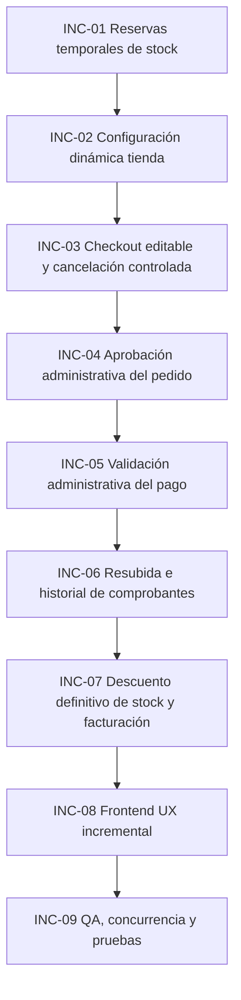

# Sprints incrementales — Mejoras del módulo Tienda Online

> **Propósito:** documentar únicamente las nuevas funcionalidades a añadir al módulo de tienda online ya planificado.  
> No se repite lo que ya existe en los sprints base de catálogo, carrito, checkout, pedidos, pagos, facturación o frontend.

## Alcance de estos nuevos sprints

Estos sprints agregan mejoras sobre el módulo Tienda:

1. Reservas temporales de stock.
2. Uso obligatorio de `DB::transaction()` y `lockForUpdate()` en operaciones críticas.
3. Tiempos configurables desde dashboard para carrito, checkout y corrección de pago.
4. Flujo administrativo separado: aprobación/rechazo de pedido y validación de pago.
5. Resubida de comprobantes cuando el pago es observado o rechazado.
6. Historial de comprobantes de pago.
7. Descuento definitivo de stock solo cuando el admin acepta el pago.
8. QA, pruebas de concurrencia, expiración y estados.

## Lo que NO se vuelve a implementar

No se repiten ni se rehacen estos módulos base:

- Catálogo público.
- Carrito base.
- Checkout base.
- Registro/login de cliente.
- Pedidos web base.
- Pagos web base.
- Facturación base.
- Storefront base.
- Área cliente base.

Estos sprints asumen que esas funcionalidades ya existen o ya están documentadas en el plan principal.

## Orden recomendado

## Convenciones técnicas obligatorias

- No modificar tablas legacy existentes.
- No repetir migraciones ya creadas.
- Solo crear tablas nuevas o agregar columnas a tablas nuevas del módulo tienda si aún no están implementadas.
- Las operaciones críticas deben ejecutarse con `DB::transaction()`.
- El bloqueo pesimista debe realizarse con `lockForUpdate()`.
- El stock físico real solo se descuenta cuando el admin acepta el pago.
- El stock visible al cliente debe considerar reservas activas no expiradas.
